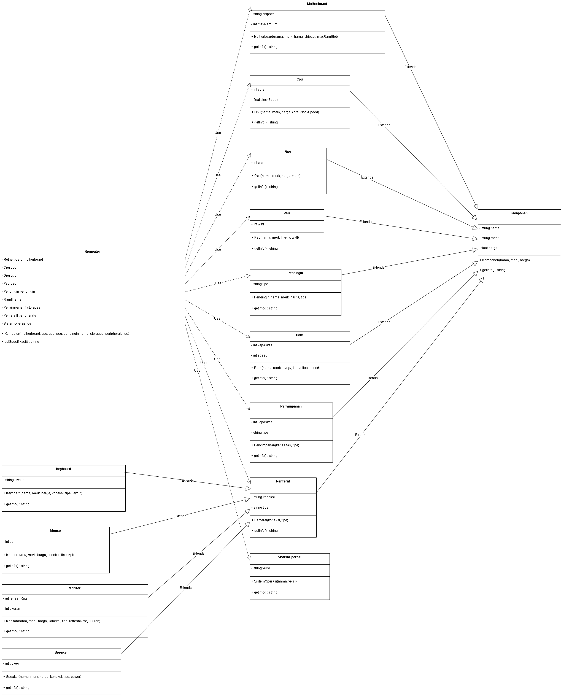

# README - Program Komputer

## Janji
Saya Muhammad Isa Abdullah dengan NIM 2303508 mengerjakan Latihan Modul 1 dalam mata kuliah Desain dan Pemrograman Berorientasi Objek untuk keberkahanNya maka saya tidak melakukan kecurangan seperti yang telah dispesifikasikan. Aamiin.

# Alur Program

Program ini merupakan implementasi dari konsep Object-Oriented Programming (OOP) dalam bahasa Java, C++, dan Python. Program ini memungkinkan pengguna untuk mengelola spesifikasi komputer dengan berbagai komponen dan periferal. Berikut adalah alur program secara umum:

## Inisialisasi Komponen

1. Program dimulai dengan membuat objek-objek komponen komputer seperti CPU, GPU, RAM, PSU, Motherboard, Penyimpanan, Sistem Operasi, dan Pendingin.
2. Selain itu, objek periferal seperti Keyboard, Mouse, Monitor, dan Speaker juga dibuat.

## Membuat Objek Komputer

Setelah semua komponen dan periferal diinisialisasi, objek Komputer dibuat dengan menggabungkan semua komponen dan periferal tersebut.

## Menampilkan Spesifikasi Komputer

Program kemudian menampilkan spesifikasi lengkap dari komputer yang telah dibuat, termasuk detail dari setiap komponen dan periferal.

## Pengelolaan Periferal

Program juga menyediakan fungsi untuk menambah dan menghapus periferal dari daftar periferal yang dimiliki oleh komputer.

# Konsep Desain Kelas

## Kelas Komponen

Kelas Komponen adalah kelas dasar yang digunakan untuk mendefinisikan atribut umum dari semua komponen komputer. Kelas ini memiliki atribut merk dan nama.

### Atribut

- `merk`: Merek dari komponen.
- `nama`: Nama dari komponen.

### Metode

- `setMerk(String merk)`: Mengatur merek komponen.
- `setNama(String nama)`: Mengatur nama komponen.
- `getMerk()`: Mengambil merek komponen.
- `getNama()`: Mengambil nama komponen.

## Kelas Cpu, Gpu, Ram, PSU, Motherboard, Penyimpanan, SistemOperasi, Pendingin

Kelas-kelas ini merupakan turunan dari kelas Komponen dan memiliki atribut tambahan yang spesifik untuk masing-masing jenis komponen.

### Contoh Atribut Tambahan

- **Cpu**: `jumlahCore`, `kecepatanGHz`
- **Gpu**: `vramGB`, `chipset`
- **Ram**: `kapasitasGB`, `ddr`
- **PSU**: `dayaWatt`, `sertifikasi`
- **Motherboard**: `socket`, `chipset`, `jumlahSlotRam`
- **Penyimpanan**: `kapasitasGB`, `tipe`
- **SistemOperasi**: `versi`, `berlisensi`
- **Pendingin**: `tipe`, `kecepatanRPM`

## Kelas Periferal

Kelas Periferal juga merupakan turunan dari kelas Komponen dan memiliki atribut tambahan koneksi.

### Atribut

- `koneksi`: Jenis koneksi dari periferal (misalnya USB, HDMI).

## Kelas Komputer

Kelas Komputer adalah kelas utama yang menggabungkan semua komponen dan periferal untuk membentuk sebuah komputer.

### Atribut

- `nama`: Nama dari komputer.
- `cpu`: Objek Cpu.
- `gpu`: Objek Gpu.
- `ram`: Objek Ram.
- `psu`: Objek PSU.
- `motherboard`: Objek Motherboard.
- `penyimpanan`: Objek Penyimpanan.
- `sistemOperasi`: Objek SistemOperasi.
- `pendingin`: Objek Pendingin.
- `periferalList`: Daftar objek Periferal.

### Metode

- `setNama(String nama)`: Mengatur nama komputer.
- `getNama()`: Mengambil nama komputer.
- `setCpu(Cpu cpu)`: Mengatur CPU komputer.
- `getCpu()`: Mengambil CPU komputer.
- `setGpu(Gpu gpu)`: Mengatur GPU komputer.
- `getGpu()`: Mengambil GPU komputer.
- `setRam(Ram ram)`: Mengatur RAM komputer.
- `getRam()`: Mengambil RAM komputer.
- `setPsu(PSU psu)`: Mengatur PSU komputer.
- `getPsu()`: Mengambil PSU komputer.
- `setMotherboard(Motherboard motherboard)`: Mengatur Motherboard komputer.
- `getMotherboard()`: Mengambil Motherboard komputer.
- `setPenyimpanan(Penyimpanan penyimpanan)`: Mengatur Penyimpanan komputer.
- `getPenyimpanan()`: Mengambil Penyimpanan komputer.
- `setSistemOperasi(SistemOperasi sistemOperasi)`: Mengatur Sistem Operasi komputer.
- `getSistemOperasi()`: Mengambil Sistem Operasi komputer.
- `setPendingin(Pendingin pendingin)`: Mengatur Pendingin komputer.
- `getPendingin()`: Mengambil Pendingin komputer.
- `setPeriferalList(List<Periferal> periferalList)`: Mengatur daftar periferal komputer.
- `getPeriferalList()`: Mengambil daftar periferal komputer.
- `tambahPeriferal(Periferal periferal)`: Menambah periferal ke daftar periferal komputer.
- `hapusPeriferal(Periferal periferal)`: Menghapus periferal dari daftar periferal komputer.
- `tampilkanSpesifikasi()`: Menampilkan spesifikasi lengkap dari komputer.